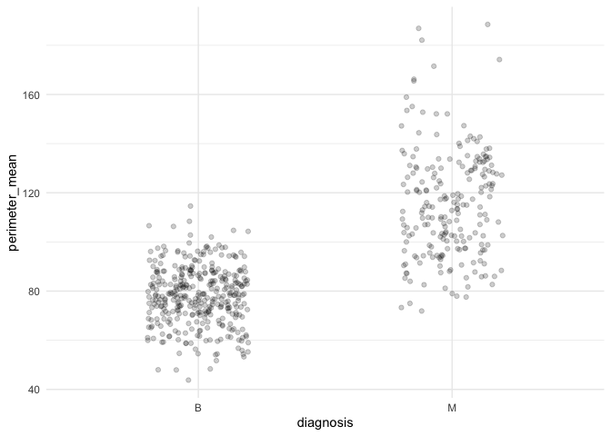

Mini Data-Analysis Deliverable 1
================
Ekpereka Amutaigwe
October 9, 2021

-   [1. Introduction](#1-introduction)
    -   [1.1 Learning Objectives](#11-learning-objectives)
    -   [1.2 Install the `datateachr`
        package](#12-install-the-datateachr-package)
    -   [1.3 Load required packages](#13-load-required-packages)
-   [2. Define variables](#2-define-variables)
-   [3. Task 1: Choose your favorite
    dataset](#3-task-1-choose-your-favorite-dataset)
    -   [3.1. Instructions for the project as given by the teaching
        team](#31-instructions-for-the-project-as-given-by-the-teaching-team)
        -   [3.1.1. Choose 4 datasets](#311-choose-4-datasets)
        -   [3.1.2. Explore the datasets to have an idea of what they
            look
            like](#312-explore-the-datasets-to-have-an-idea-of-what-they-look-like)
        -   [3.1.3. Choose 2 datasets](#313-choose-2-datasets)
        -   [3.1.4. One research question for each
            dataset](#314-one-research-question-for-each-dataset)
-   [4. Task 2: Exploring your
    dataset](#4-task-2-exploring-your-dataset)
    -   [4.1. The 4 exercises](#41-the-4-exercises)
-   [5. Task 3: Write your research
    questions](#5-task-3-write-your-research-questions)
    -   [5.1. The 4 research questions I would like to answer using the
        *apt_buildings*
        data](#51-the-4-research-questions-i-would-like-to-answer-using-the-apt_buildings-data)

## 1. Introduction

This mini-project is part of the deliverables in the STAT545A course. It
involves installation of the `datateachr` package by Hayley Boyce and
Jordan Bourak which currently consists of 7 semi-tidy datasets.

It also requires loading the `datateachr` and `tidyverse` packages which
are necessary for a successful completion of the project.

**There are 3 major tasks in this project**:

-   Choose your favorite dataset
-   Explore your dataset
-   Write your research questions

### 1.1 Learning Objectives

By the end of this project, I should:

-   Become familiar with the datasets, especially the one I choose to
    work with in greater depth
-   Be able to formulate 4 research questions that I would like to
    answer with my data
-   Generate a well written and reproducible report using R Markdown

### 1.2 Install the [`datateachr`](https://github.com/UBC-MDS/datateachr) package

To install the **datateachr** package, first install the **devtools**
package using **install.packages()** with parentheses surrounding
*devtools* in your **R console** and load the **devtools** package using
**library()** before installing *datateachr* with this code-
**devtools::install_github(“UBC-MDS/datateachr”)**. It is a one-off
exercise in that once it is installed, you only need to reload it
whenever you start a new session to use the package and the datasets it
contains.

### 1.3 Load required packages

``` r
library(datateachr)
library(tidyverse)
```

    ## ── Attaching packages ─────────────────────────────────────── tidyverse 1.3.1 ──

    ## ✓ ggplot2 3.3.5     ✓ purrr   0.3.4
    ## ✓ tibble  3.1.5     ✓ dplyr   1.0.7
    ## ✓ tidyr   1.1.3     ✓ stringr 1.4.0
    ## ✓ readr   2.0.2     ✓ forcats 0.5.1

    ## ── Conflicts ────────────────────────────────────────── tidyverse_conflicts() ──
    ## x dplyr::filter() masks stats::filter()
    ## x dplyr::lag()    masks stats::lag()

## 2. Define variables

It is always beneficial to define the variables/datasets you will be
using in your analysis early in your project. The datasets can be
explored without defining them once the package containing them is
loaded. However, for clarity and to notice at a glance the source of the
datasets, I like to define them early enough.

``` r
# define variables
apt_buildings <- datateachr::apt_buildings
building_permits <- datateachr::building_permits
cancer_sample <- datateachr::cancer_sample
flow_sample <- datateachr::flow_sample
parking_meters <- datateachr::parking_meters
steam_games <- datateachr::steam_games
vancouver_trees <- datateachr::vancouver_trees
```

## 3. Task 1: Choose your favorite dataset

As mentioned earlier, the following are the 7 datasets to choose from:

-   *apt_buildings*: Acquired courtesy of The City of Toronto’s Open
    Data Portal. It currently has 3455 rows and 37 columns.
-   *building_permits*: Acquired courtesy of the City of Vancouver’s
    Open Data Portal. It currently has 20680 rows and 14 columns.
-   *cancer_sample*: Acquired courtesy of UCI Machine Learning
    Repository. It currently has 569 rows and 32 columns.
-   *flow_sample*: Acquired courtesy of The Government of Canada’s
    Historical Hydrometric Database. It currently has 218 rows and 7
    columns.
-   *parking-meters*: Acquired courtesy of The City of Vancouver’s Open
    Data Portal. It currently has 10032 rows and 22 columns.
-   *steam_games*: Acquired courtesy of Kaggle. It currently has 40833
    rows and 21 columns.
-   *vancouver_trees*: Acquired courtesy of The City of Vancouver’s Open
    Data Portal. It currently has 146611 rows and 20 columns.

**The above description is an excerpt from the milestone document for
the project prepared by Icíar Fernández Boyano and launched by Vincenzo
Coia**.

### 3.1. Instructions for the project as given by the teaching team

#### 3.1.1. Choose 4 datasets

**Instruction 1.1**: Out of the 7 datasets available in the
**datateachr** package, choose **4** that appeal to you based on their
description.

**The 4 choices**

1.  apt_buildings
2.  cancer_sample
3.  flow_sample
4.  vancouver_trees

#### 3.1.2. Explore the datasets to have an idea of what they look like

**Instruction 1.2**: One way to narrow down your selection is to
*explore* the datasets. Use your knowledge of dplyr to find out at least
3 attributes about each of these datasets. The goal is to have an idea
of *what the data looks like*

*To explore each of the four chosen datasets, I will look at class of
the data, variable types, number of rows and columns, the variable
names, the total number of missing values (NAs).*

``` r
# explore the apt_buildings dataset
# get class of the dataset
class(apt_buildings)
```

    ## [1] "tbl_df"     "tbl"        "data.frame"

``` r
# find out number of rows and columns, names of variables, variable types
glimpse(apt_buildings)
```

    ## Rows: 3,455
    ## Columns: 37
    ## $ id                               <dbl> 10359, 10360, 10361, 10362, 10363, 10…
    ## $ air_conditioning                 <chr> "NONE", "NONE", "NONE", "NONE", "NONE…
    ## $ amenities                        <chr> "Outdoor rec facilities", "Outdoor po…
    ## $ balconies                        <chr> "YES", "YES", "YES", "YES", "NO", "NO…
    ## $ barrier_free_accessibilty_entr   <chr> "YES", "NO", "NO", "YES", "NO", "NO",…
    ## $ bike_parking                     <chr> "0 indoor parking spots and 10 outdoo…
    ## $ exterior_fire_escape             <chr> "NO", "NO", "NO", "YES", "NO", NA, "N…
    ## $ fire_alarm                       <chr> "YES", "YES", "YES", "YES", "YES", "Y…
    ## $ garbage_chutes                   <chr> "YES", "YES", "NO", "NO", "NO", "NO",…
    ## $ heating_type                     <chr> "HOT WATER", "HOT WATER", "HOT WATER"…
    ## $ intercom                         <chr> "YES", "YES", "YES", "YES", "YES", "Y…
    ## $ laundry_room                     <chr> "YES", "YES", "YES", "YES", "YES", "Y…
    ## $ locker_or_storage_room           <chr> "NO", "YES", "YES", "YES", "NO", "YES…
    ## $ no_of_elevators                  <dbl> 3, 3, 0, 1, 0, 0, 0, 2, 4, 2, 0, 2, 2…
    ## $ parking_type                     <chr> "Underground Garage , Garage accessib…
    ## $ pets_allowed                     <chr> "YES", "YES", "YES", "YES", "YES", "Y…
    ## $ prop_management_company_name     <chr> NA, "SCHICKEDANZ BROS. PROPERTIES", N…
    ## $ property_type                    <chr> "PRIVATE", "PRIVATE", "PRIVATE", "PRI…
    ## $ rsn                              <dbl> 4154812, 4154815, 4155295, 4155309, 4…
    ## $ separate_gas_meters              <chr> "NO", "NO", "NO", "NO", "NO", "NO", "…
    ## $ separate_hydro_meters            <chr> "YES", "YES", "YES", "YES", "YES", "Y…
    ## $ separate_water_meters            <chr> "NO", "NO", "NO", "NO", "NO", "NO", "…
    ## $ site_address                     <chr> "65  FOREST MANOR RD", "70  CLIPPER R…
    ## $ sprinkler_system                 <chr> "YES", "YES", "NO", "YES", "NO", "NO"…
    ## $ visitor_parking                  <chr> "PAID", "FREE", "UNAVAILABLE", "UNAVA…
    ## $ ward                             <chr> "17", "17", "03", "03", "02", "02", "…
    ## $ window_type                      <chr> "DOUBLE PANE", "DOUBLE PANE", "DOUBLE…
    ## $ year_built                       <dbl> 1967, 1970, 1927, 1959, 1943, 1952, 1…
    ## $ year_registered                  <dbl> 2017, 2017, 2017, 2017, 2017, NA, 201…
    ## $ no_of_storeys                    <dbl> 17, 14, 4, 5, 4, 4, 4, 7, 32, 4, 4, 7…
    ## $ emergency_power                  <chr> "NO", "YES", "NO", "NO", "NO", "NO", …
    ## $ `non-smoking_building`           <chr> "YES", "NO", "YES", "YES", "YES", "NO…
    ## $ no_of_units                      <dbl> 218, 206, 34, 42, 25, 34, 14, 105, 57…
    ## $ no_of_accessible_parking_spaces  <dbl> 8, 10, 20, 42, 12, 0, 5, 1, 1, 6, 12,…
    ## $ facilities_available             <chr> "Recycling bins", "Green Bin / Organi…
    ## $ cooling_room                     <chr> "NO", "NO", "NO", "NO", "NO", "NO", "…
    ## $ no_barrier_free_accessible_units <dbl> 2, 0, 0, 42, 0, NA, 14, 0, 0, 1, 25, …

``` r
# get total number of missing values(NAs)
sum(is.na(apt_buildings))
```

    ## [1] 6286

From the analysis above, one can conclude that the *apt_buildings* is a
tibble that has 3,455 rows and 37 columns. The data contains mostly
character variables with few doubles. A total of 6286 values are missing
(NAs).

``` r
# explore the cancer_sample dataset
# get class of the dataset
class(cancer_sample)
```

    ## [1] "spec_tbl_df" "tbl_df"      "tbl"         "data.frame"

``` r
# find out number of rows and columns, names of variables, variable types
glimpse(cancer_sample)
```

    ## Rows: 569
    ## Columns: 32
    ## $ ID                      <dbl> 842302, 842517, 84300903, 84348301, 84358402, …
    ## $ diagnosis               <chr> "M", "M", "M", "M", "M", "M", "M", "M", "M", "…
    ## $ radius_mean             <dbl> 17.990, 20.570, 19.690, 11.420, 20.290, 12.450…
    ## $ texture_mean            <dbl> 10.38, 17.77, 21.25, 20.38, 14.34, 15.70, 19.9…
    ## $ perimeter_mean          <dbl> 122.80, 132.90, 130.00, 77.58, 135.10, 82.57, …
    ## $ area_mean               <dbl> 1001.0, 1326.0, 1203.0, 386.1, 1297.0, 477.1, …
    ## $ smoothness_mean         <dbl> 0.11840, 0.08474, 0.10960, 0.14250, 0.10030, 0…
    ## $ compactness_mean        <dbl> 0.27760, 0.07864, 0.15990, 0.28390, 0.13280, 0…
    ## $ concavity_mean          <dbl> 0.30010, 0.08690, 0.19740, 0.24140, 0.19800, 0…
    ## $ concave_points_mean     <dbl> 0.14710, 0.07017, 0.12790, 0.10520, 0.10430, 0…
    ## $ symmetry_mean           <dbl> 0.2419, 0.1812, 0.2069, 0.2597, 0.1809, 0.2087…
    ## $ fractal_dimension_mean  <dbl> 0.07871, 0.05667, 0.05999, 0.09744, 0.05883, 0…
    ## $ radius_se               <dbl> 1.0950, 0.5435, 0.7456, 0.4956, 0.7572, 0.3345…
    ## $ texture_se              <dbl> 0.9053, 0.7339, 0.7869, 1.1560, 0.7813, 0.8902…
    ## $ perimeter_se            <dbl> 8.589, 3.398, 4.585, 3.445, 5.438, 2.217, 3.18…
    ## $ area_se                 <dbl> 153.40, 74.08, 94.03, 27.23, 94.44, 27.19, 53.…
    ## $ smoothness_se           <dbl> 0.006399, 0.005225, 0.006150, 0.009110, 0.0114…
    ## $ compactness_se          <dbl> 0.049040, 0.013080, 0.040060, 0.074580, 0.0246…
    ## $ concavity_se            <dbl> 0.05373, 0.01860, 0.03832, 0.05661, 0.05688, 0…
    ## $ concave_points_se       <dbl> 0.015870, 0.013400, 0.020580, 0.018670, 0.0188…
    ## $ symmetry_se             <dbl> 0.03003, 0.01389, 0.02250, 0.05963, 0.01756, 0…
    ## $ fractal_dimension_se    <dbl> 0.006193, 0.003532, 0.004571, 0.009208, 0.0051…
    ## $ radius_worst            <dbl> 25.38, 24.99, 23.57, 14.91, 22.54, 15.47, 22.8…
    ## $ texture_worst           <dbl> 17.33, 23.41, 25.53, 26.50, 16.67, 23.75, 27.6…
    ## $ perimeter_worst         <dbl> 184.60, 158.80, 152.50, 98.87, 152.20, 103.40,…
    ## $ area_worst              <dbl> 2019.0, 1956.0, 1709.0, 567.7, 1575.0, 741.6, …
    ## $ smoothness_worst        <dbl> 0.1622, 0.1238, 0.1444, 0.2098, 0.1374, 0.1791…
    ## $ compactness_worst       <dbl> 0.6656, 0.1866, 0.4245, 0.8663, 0.2050, 0.5249…
    ## $ concavity_worst         <dbl> 0.71190, 0.24160, 0.45040, 0.68690, 0.40000, 0…
    ## $ concave_points_worst    <dbl> 0.26540, 0.18600, 0.24300, 0.25750, 0.16250, 0…
    ## $ symmetry_worst          <dbl> 0.4601, 0.2750, 0.3613, 0.6638, 0.2364, 0.3985…
    ## $ fractal_dimension_worst <dbl> 0.11890, 0.08902, 0.08758, 0.17300, 0.07678, 0…

``` r
# get total number of missing values(NAs)
sum(is.na(cancer_sample))
```

    ## [1] 0

The analysis above shows that the *cancer_sample* dataset is a tibble
with 569 rows and 32 columns. Most of the variables are doubles with
only 1 character variable. Surprisingly, there’s no missing value in the
dataset.

``` r
# explore the flow_sample dataset
# get class of the dataset
class(flow_sample)
```

    ## [1] "tbl_df"     "tbl"        "data.frame"

``` r
# determine number of rows and columns, names of variables, variable types
glimpse(flow_sample)
```

    ## Rows: 218
    ## Columns: 7
    ## $ station_id   <chr> "05BB001", "05BB001", "05BB001", "05BB001", "05BB001", "0…
    ## $ year         <dbl> 1909, 1910, 1911, 1912, 1913, 1914, 1915, 1916, 1917, 191…
    ## $ extreme_type <chr> "maximum", "maximum", "maximum", "maximum", "maximum", "m…
    ## $ month        <dbl> 7, 6, 6, 8, 6, 6, 6, 6, 6, 6, 6, 7, 6, 6, 6, 7, 5, 7, 6, …
    ## $ day          <dbl> 7, 12, 14, 25, 11, 18, 27, 20, 17, 15, 22, 3, 9, 5, 14, 5…
    ## $ flow         <dbl> 314, 230, 264, 174, 232, 214, 236, 309, 174, 345, 185, 24…
    ## $ sym          <chr> NA, NA, NA, NA, NA, NA, NA, NA, NA, NA, NA, NA, NA, NA, N…

``` r
# get total number of missing values(NAs)
sum(is.na(flow_sample))
```

    ## [1] 125

The *flow_sample* dataset is a tibble, and has 218 rows and 7 columns.
The variable types are roughly equal- 3 characters and 4 doubles. There
are 125 missing values in the dataset.

``` r
# explore the vancouver_trees dataset
#  get class of the dataset
class(vancouver_trees)
```

    ## [1] "tbl_df"     "tbl"        "data.frame"

``` r
# determine number of rows and columns, names of variables, variable types
glimpse(vancouver_trees)
```

    ## Rows: 146,611
    ## Columns: 20
    ## $ tree_id            <dbl> 149556, 149563, 149579, 149590, 149604, 149616, 149…
    ## $ civic_number       <dbl> 494, 450, 4994, 858, 5032, 585, 4909, 4925, 4969, 7…
    ## $ std_street         <chr> "W 58TH AV", "W 58TH AV", "WINDSOR ST", "E 39TH AV"…
    ## $ genus_name         <chr> "ULMUS", "ZELKOVA", "STYRAX", "FRAXINUS", "ACER", "…
    ## $ species_name       <chr> "AMERICANA", "SERRATA", "JAPONICA", "AMERICANA", "C…
    ## $ cultivar_name      <chr> "BRANDON", NA, NA, "AUTUMN APPLAUSE", NA, "CHANTICL…
    ## $ common_name        <chr> "BRANDON ELM", "JAPANESE ZELKOVA", "JAPANESE SNOWBE…
    ## $ assigned           <chr> "N", "N", "N", "Y", "N", "N", "N", "N", "N", "N", "…
    ## $ root_barrier       <chr> "N", "N", "N", "N", "N", "N", "N", "N", "N", "N", "…
    ## $ plant_area         <chr> "N", "N", "4", "4", "4", "B", "6", "6", "3", "3", "…
    ## $ on_street_block    <dbl> 400, 400, 4900, 800, 5000, 500, 4900, 4900, 4900, 7…
    ## $ on_street          <chr> "W 58TH AV", "W 58TH AV", "WINDSOR ST", "E 39TH AV"…
    ## $ neighbourhood_name <chr> "MARPOLE", "MARPOLE", "KENSINGTON-CEDAR COTTAGE", "…
    ## $ street_side_name   <chr> "EVEN", "EVEN", "EVEN", "EVEN", "EVEN", "ODD", "ODD…
    ## $ height_range_id    <dbl> 2, 4, 3, 4, 2, 2, 3, 3, 2, 2, 2, 5, 3, 2, 2, 2, 2, …
    ## $ diameter           <dbl> 10.00, 10.00, 4.00, 18.00, 9.00, 5.00, 15.00, 14.00…
    ## $ curb               <chr> "N", "N", "Y", "Y", "Y", "Y", "Y", "Y", "Y", "Y", "…
    ## $ date_planted       <date> 1999-01-13, 1996-05-31, 1993-11-22, 1996-04-29, 19…
    ## $ longitude          <dbl> -123.1161, -123.1147, -123.0846, -123.0870, -123.08…
    ## $ latitude           <dbl> 49.21776, 49.21776, 49.23938, 49.23469, 49.23894, 4…

``` r
# get total number of missing values
sum(is.na(vancouver_trees))
```

    ## [1] 191135

To summarize findings from the *vancouver_trees* dataset, it is a
tibble, and comprises 146,611 rows and 20 columns. There are more
character variables than doubles. There’s one date variable type. There
are multiple missing values in the dataset(191,135).

#### 3.1.3. Choose 2 datasets

**Instruction 1.3**: Now that you’ve explored the 4 datasets that you
were initially interested in, let’s narrow it down to 2. What led you to
choose these 2? Briefly explain your choices below, and feel free to
include any code in your explanation.

**The 2 choices are:**

1.  apt_buildings
2.  cancer_sample

**Brief reasons for the 2 choices**

**First**, I chose **apt_buildings** because when I explored it, I could
see that there are 37 columns in the dataset with `heating_type` as part
of the variables. So, I became curious to see the most commonly used
heating system. Therefore, I ran the code below.

``` r
# determine the most commonly used heating system
apt_buildings %>% ggplot(aes(heating_type)) +
   geom_bar()
```

<!-- -->

**Second**, I chose **cancer_sample** because I wanted to investigate
the relationship between diagnosis (benign or malignant) and mean
perimeter of nuclei of samples. To find out, I ran the code below.

``` r
# investigate the relationship between diagnosis(benign and malignant) and mean perimeter of nuclei
cancer_sample %>% ggplot(aes(diagnosis, perimeter_mean)) + 
  geom_jitter(alpha = 0.2, width = 0.2) + 
  theme_minimal()
```

<!-- -->

#### 3.1.4. One research question for each dataset

**Instruction 1.4**: Try to think of 1 research question that you would
want to answer with each dataset. Note them down below, and make your
final choice based on what seems more interesting to you!

**Below is one research question for each dataset**

-   `apt_buildings`: Did the number of storeys built increase over the
    years?
-   `flow_sample`: Which months had the highest flow intensity?
-   `cancer_sample`: Is there a relationship between diagnosis and mean
    perimeter of nuclei?
-   `vancouver_trees`: Does each tree planted have a root barrier
    installed?

**Final choice**: Out of the four research questions, it seems
investigating whether the number of storeys built increased as the years
rolled by would be the most interesting.Therefore, I choose the
`apt_buildings` dataset.

## 4. Task 2: Exploring your dataset

**Instruction 2.1**: Complete *4* out of the following *8* exercises to
dive deeper into your data. All datasets are different and therefore,
not all of these tasks may make sense for your data - which is why you
should only answer 4. Use *dplyr* and *ggplot*.

1.  Plot the distribution of a numeric variable.
2.  Create a new variable based on other variables in your data (only if
    it makes sense).
3.  Investigate how many missing values there are per variable. Can you
    find a way to plot this?
4.  Explore the relationship between 2 variables in a plot.
5.  Filter observations in your data according to your own criteria.
    Think of what you’d like to explore - again, if this was the titanic
    dataset, I may want to narrow my search to passengers born in a
    particular year…
6.  Use a boxplot to look at the frequency of different observations
    within a single variable. You can do this for more than one variable
    if you wish!
7.  Make a new tibble with a subset of your data, with variables and
    observations that you are interested in exploring.
8.  Use a density plot to explore any of your variables (that are
    suitable for this type of plot).

### 4.1. The 4 exercises

**Plot the distribution of a numeric variable**

``` r
# plot the distribution of a numeric variable
apt_buildings %>% ggplot(aes(no_of_storeys)) +
    geom_histogram(binwidth = 1.5)
```

<!-- -->

`no_of_storeys` is a numeric variable in the *apt_buildings* dataset.
Therefore, I wanted to investigate the spread of the number of storeys
built. `geom_histogram` is one of the geometric objects for visualizing
distribution of numeric/continuous variables in a dataset. I piped (%>%)
the data into the ggplot function and mapped `no_of_storeys` to the
x-axis as geom_histogram takes only the variable for the x-axis and
computes `count` on the y-axis.

**Explore the relationship between two variables in a plot**

``` r
# Explore the relationship between the year a building was erected and the number of storeys built in a plot
apt_buildings %>% ggplot(aes(year_built, no_of_storeys)) +
  geom_jitter(alpha = 0.1, width = 0.2, na.rm = TRUE) + theme_minimal()
```

<!-- -->

To investigate the number of storeys (numeric variable) that were
erected as the years rolled by (in this case a numeric variable), I
chose a `jitterplot`. A jitterplot helps to jitter the points in a
controlled manner to separate overlapping points in a large dataset. I
also used `alpha` to make the points more transparent so as to see the
points more clearly. The plot shows that the number of storeys built
increased rapidly after 1950, with the highest building erected after
the year 2000.

**Make a new tibble with a subset of your data, with variables and
observations that you are interested in exploring**

``` r
# make a new tibble with a subset of your data, with variables and observations that you are interested in exploring
apt_buildings_sub <- apt_buildings %>% 
     select(id:no_barrier_free_accessible_units, -c(amenities, barrier_free_accessibilty_entr, bike_parking, pets_allowed, prop_management_company_name, rsn, site_address, year_registered)) %>% 
     filter(year_built >= 1950) %>% 
     arrange(desc(no_of_storeys))

# take a look at the new tibble
glimpse(apt_buildings_sub)
```

    ## Rows: 3,021
    ## Columns: 29
    ## $ id                               <dbl> 11615, 12036, 12555, 12793, 13594, 12…
    ## $ air_conditioning                 <chr> "INDIVIDUAL UNITS", "CENTRAL AIR", "I…
    ## $ balconies                        <chr> "YES", "YES", "NO", "NO", "YES", "YES…
    ## $ exterior_fire_escape             <chr> "YES", "NO", "YES", "YES", "NO", "NO"…
    ## $ fire_alarm                       <chr> "YES", "YES", "YES", "YES", "YES", "Y…
    ## $ garbage_chutes                   <chr> "YES", "YES", "YES", "YES", "YES", "Y…
    ## $ heating_type                     <chr> "HOT WATER", "HOT WATER", "FORCED AIR…
    ## $ intercom                         <chr> "YES", "YES", "YES", "NO", "YES", "YE…
    ## $ laundry_room                     <chr> "NO", "YES", "YES", "YES", "YES", "YE…
    ## $ locker_or_storage_room           <chr> "YES", "YES", "YES", "YES", "YES", "Y…
    ## $ no_of_elevators                  <dbl> 6, 4, 6, 6, 3, 4, 4, 5, 5, 5, 4, 4, 3…
    ## $ parking_type                     <chr> "Underground Garage , Garage accessib…
    ## $ property_type                    <chr> "PRIVATE", "PRIVATE", "PRIVATE", "PRI…
    ## $ separate_gas_meters              <chr> "NO", "NO", "NO", "NO", "NO", "NO", "…
    ## $ separate_hydro_meters            <chr> "YES", "YES", "YES", "YES", "NO", "YE…
    ## $ separate_water_meters            <chr> "YES", "YES", "NO", "NO", "NO", "YES"…
    ## $ sprinkler_system                 <chr> "YES", "YES", "YES", "YES", "YES", "Y…
    ## $ visitor_parking                  <chr> "FREE", "PAID", "BOTH", "BOTH", "PAID…
    ## $ ward                             <chr> "13", "YY", "15", "15", "10", "13", "…
    ## $ window_type                      <chr> NA, "DOUBLE PANE", "DOUBLE PANE", "DO…
    ## $ year_built                       <dbl> 2018, 2018, 1971, 1971, 2012, 2017, 1…
    ## $ no_of_storeys                    <dbl> 51, 43, 43, 43, 41, 37, 37, 36, 36, 3…
    ## $ emergency_power                  <chr> "YES", "YES", "YES", "YES", "YES", "Y…
    ## $ `non-smoking_building`           <chr> "YES", "NO", "YES", "YES", "YES", "NO…
    ## $ no_of_units                      <dbl> 502, 369, 496, 500, 298, 337, 285, 46…
    ## $ no_of_accessible_parking_spaces  <dbl> 6, 18, 2, 2, 4, 4, 46, 2, 48, 1, 40, …
    ## $ facilities_available             <chr> "Green Bin / Organics", "Green Bin / …
    ## $ cooling_room                     <chr> "YES", "YES", "NO", "NO", "NO", "YES"…
    ## $ no_barrier_free_accessible_units <dbl> 0, 41, 2, 2, 3, 17, 0, 0, 0, 2, 0, 0,…

I used 3 verbs (select, filter, arrange) from the `dplyr` package to
subset my data. I used `select` to choose variables from
`id to no_barrier_free_accessible_units` excluding
`amenities, barrier_free_accessibilty_entr, bike_parking, pets_allowed, prop_manangement_company_name, rsn, site_address and year_registered`
which occurred within the specified sequence. I then used `filter` to
subset my data by buidings which were erected from 1950 upward. Next, I
used `arrange` and `desc` to re-order the observations by the
`no_of_storeys` column in descending order. The new tibble was stored in
a variable named `apt_buildings_sub`. I them used `glimpse` to look at
my new tibble.

**Use a density plot to explore any of your variables**

``` r
# use a density plot to explore any of your variables
apt_buildings %>% filter(!is.na(year_built)) %>% ggplot(aes(year_built)) +
  geom_density(aes(fill = property_type), alpha = 0.2) +
  theme_minimal()
```

<!-- -->

I used a `density plot` to study the time-period from 1800 to 2019 in
relation to the property type built. I chose this exercise because it
paints a vivid picture of the time-period in which the three property
types were built.

Most of the houses were built between the years 1950 and 2000. Most
private buildings were erected between 1950 and 1975 while most
buildings in the social housing category were built between 1975 and
2000. Most buildings in the TCHC category were built shortly before 1975
and more houses in this category have been built between 1950 and 2000,
hence the wider area.

First, I filtered out missing values from `year_built` and mapped
`year_built` to the x-axis and also mapped `property_type` to the `fill`
aesthetics. An `alpha` of 0.2 was used to tone down the colour on the
plot for a better view of the three categories in property_type-
`PRIVATE, SOCIAL HOUSING, TCHC`. I also added another layer-
`theme_minimal`to lighten the grids in the background.

## 5. Task 3: Write your research questions

Figure out 4 research questions that you would like to answer with your
data.

### 5.1. The 4 research questions I would like to answer using the *apt_buildings* data

1.  In what years was the central air-conditioning system mostly
    installed in buildings?
2.  Which heating type is the most common among very tall buildings?
3.  Is there a change in the number of storeys built over the years in
    relation to window type?
4.  What is the relationship between number of storeys built and number
    of accessible parking spaces?

**The code used in this project are from what I learned in STAT545A and
the R for Data Science book by Hadley Wickham & Garrett Grolemund.**
